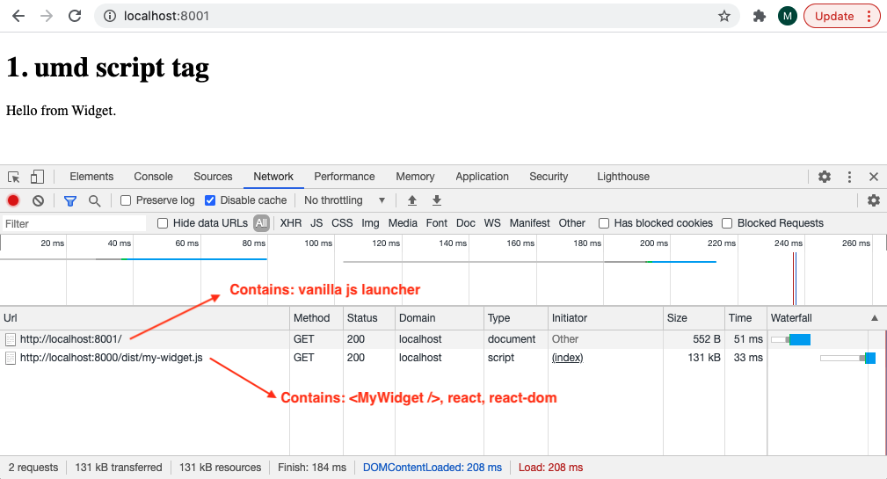
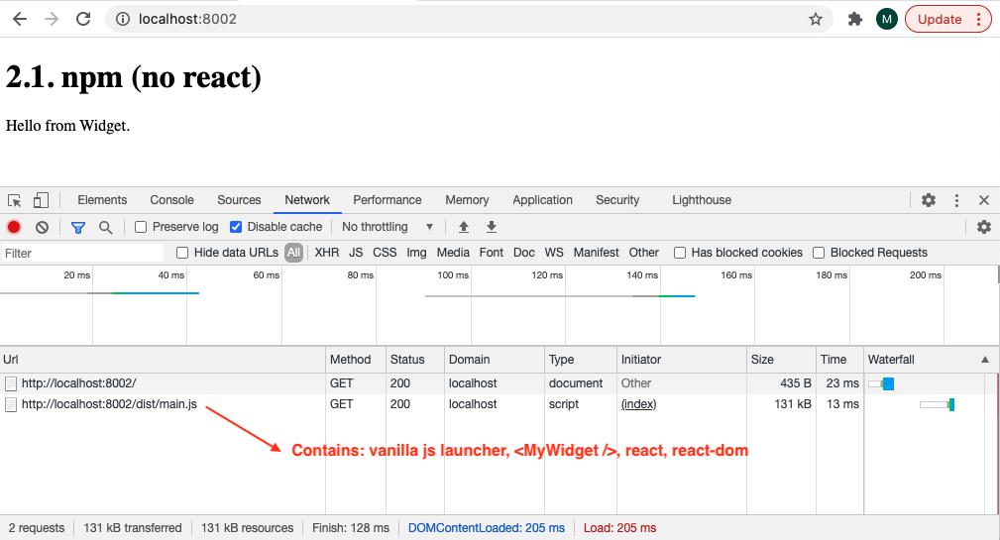
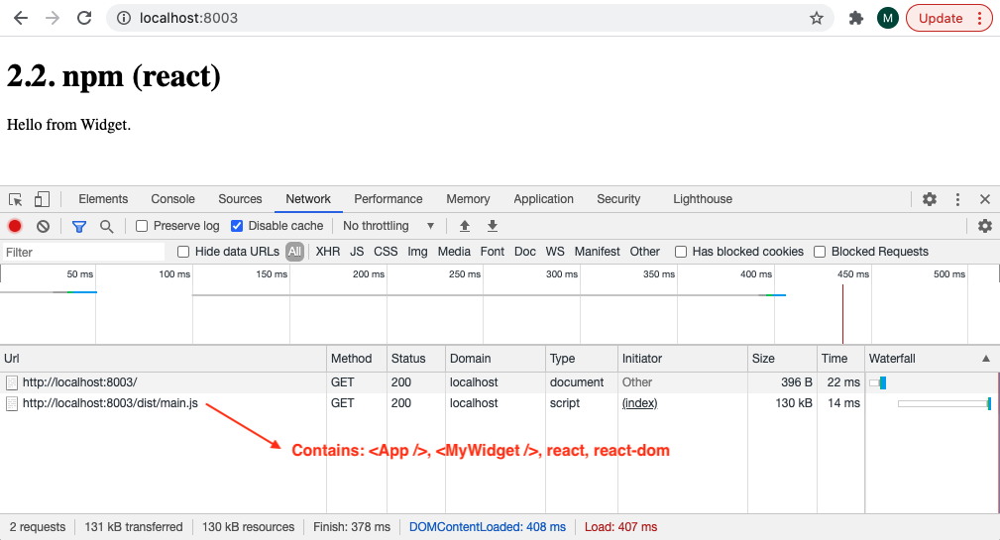
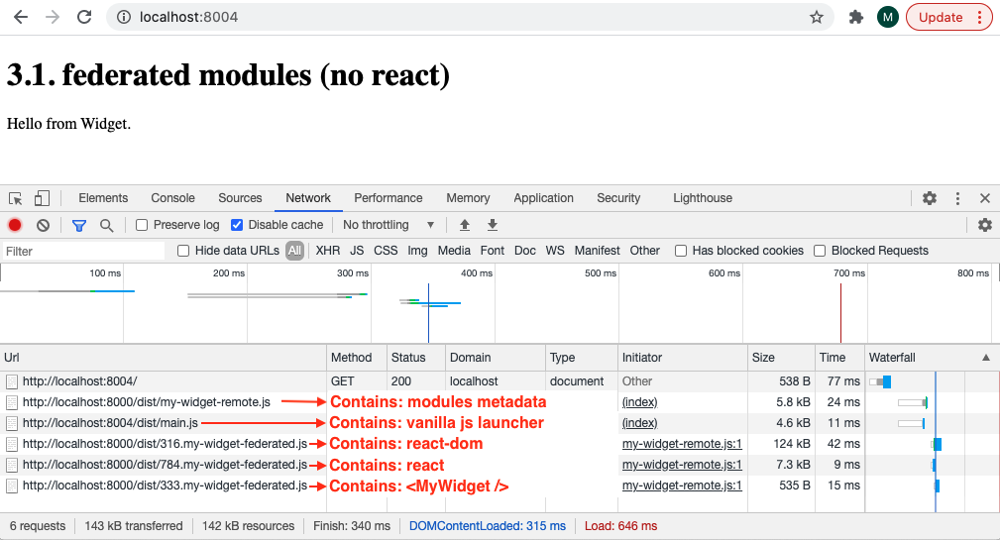
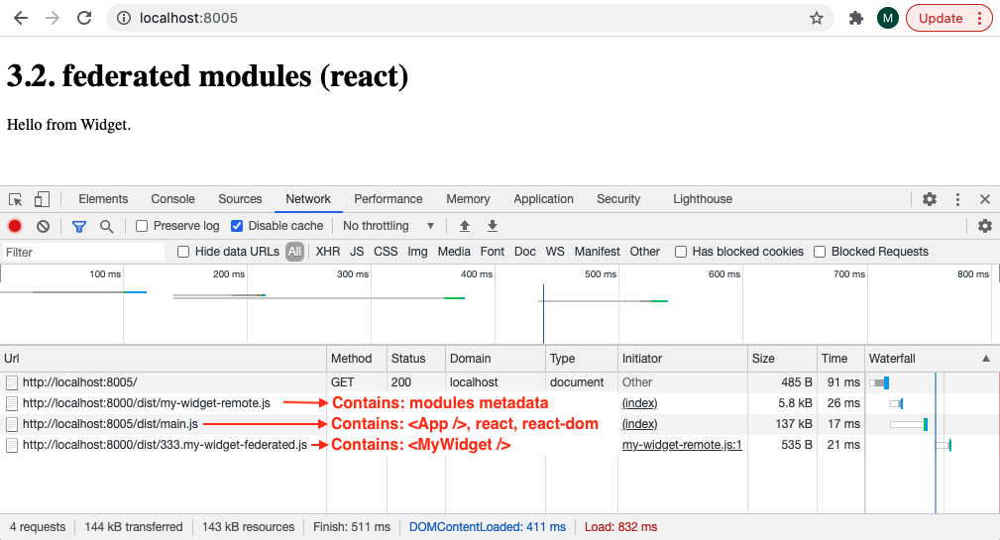

# Reusable UI widgets with webpack 5 example

This branch of the repository shows 3 different approaches to create re-usable UI widgets using [webpack 5](https://webpack.js.org/concepts/) and [TypeScript](https://www.typescriptlang.org/).

In this pattern, a host app renders a widget (i.e. an independent piece of UI) one or more times in a page. The widget can in turn be re-used in other host apps. An example of a widget can be a "share on social media" button for sharing a page.

This example consists of a very simple widget that displays the text `"Hello from Widget."` for demonstration purposes.

Additionally, this example shows how the host app and widget can be built using the same front-end framework or different ones.
In this example vanilla.js (no framework) and [react](https://reactjs.com/) are used for demonstration purposes.

## Getting started

```
$ npm install --global yarn
$ yarn install
$ yarn start
```

Then visit:

1. umd script tag: http://localhost:8001/
1. npm
   1. npm (no `react`): http://localhost:8002/
   1. npm (`react`): http://localhost:8003/
1. federated modules
   1. federated modules (no `react`): http://localhost:8004/
   1. federated modules (`react`): http://localhost:8005/

## 1. umd script tag

This approach consists of creating a self-contained library bundle that is available on the global object (i.e. `window`) and it's namespaced with a library name (`MyWidget` in this case).

```html
<script src="http://localhost:8000/dist/my-widget.js"></script>
```

```ts
import * as MyWidgetType from "my-widget";

declare global {
  const MyWidget: typeof MyWidgetType;

  interface Window {
    readonly MyWidget: typeof MyWidgetType;
  }
}
```

```ts
MyWidget.renderMyWidget(document.getElementById("widget-container"));
```

### Pros

- Simple to consume.
- Independent deployments (host app and widget).
- Consumer does not require a bundler (e.g. `webpack`).

### Cons

- Global namespace pollution.
- Internal dependencies are duplicated (if host app and widget use `react`, then `react` is downloaded and loaded in memory twice).

### Network requests



## 2. npm

This approach consists of publishing and consuming the widget as an `npm` package.
The widget `npm` package is then bundled using `webpack`.

```json
{
  "dependencies": {
    "my-widget": "1.0.0"
  }
}
```

### Pros

- Simple to consume.
- Isolated scope.
- Dependency re-usage (if host app and widget use `react`, then `react` is downloaded and loaded in memory once).
- Consumer can use any bundler (e.g. `browserify`, `rollup`).

### Cons

- Coupled deployments (a host app deployment is required whenever the widget is updated).

## 2.1. npm (no `react`)

This example shows how the widget can be consumed without using `react`.

```ts
import { render } from "my-widget";

render(document.getElementById("widget-container"));
```

### Network requests



## 2.2. npm (`react`)

This example shows how the widget can be consumed from a `react` application.

```ts
import React from "react";
import { render } from "react-dom";
import { MyWidget } from "my-widget";

const App = () => (
  <div>
    <h1>My App</h1>
    <MyWidget />
  </div>
);

render(<App />, document.getElementById("app-container"));
```

### Network requests



## 3. federated modules

This approach consists of publishing and consuming the widget using [webpack 5 federated modules](https://module-federation.github.io/).
In this approach, only the desired bits (i.e. modules) are downloaded and loaded in memory at runtime.

### Pros

- Independent deployments (host app and widget).
- Isolated scope.
- Dependency re-usage (if host app and widget use `react`, then `react` is downloaded and loaded in memory once).

### Cons

- More complex than the other options.
- Host app and widget require to be bundled using `webpack` 5.

**Note:** This approach can be used to build [micro frontend](https://micro-frontends.org/) architectures.

## 3.1. federated modules (no `react`)

This example shows how the widget can be consumed without using `react`.

```ts
import("my-widget/my-widget").then(({ render }) => {
  render(document.getElementById("widget-container"));
});
```

### Network requests



## 3.2. federated modules (`react`)

This example shows how the widget can be consumed from a `react` application.

```ts
import React, { lazy, Suspense } from "react";
import { render } from "react-dom";

const MyWidget = lazy(() => import("my-widget/my-widget"));

const App = () => (
  <Suspense fallback="Loading...">
    <MyWidget />
  </Suspense>
);

render(<App />, document.getElementById("app-container"));
```

### Network requests


